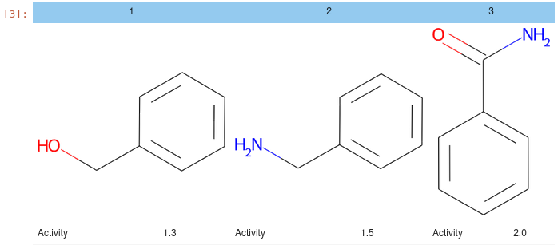

# jupy_tools

*Update 13-Nov-2024: To stay compatible with the latest RDKit, the structure standardization tools are updated, using the rdXXX modules. This also requires the removal of the `legacy` tautomerization option from the `stand_struct.py` script. If you want to keep using the `legacy` mode, you need to checkout an older version of this repository and use an older version of RDKit, e.g. of 2023.*

(Again, I am showing everyone how untalented I am in naming things)

A set of convenience tools for my work with JupyterLab.  
They mostly deal with Pandas, RDKit and Cell Painting.  
There are also utilities for displaying HTML tables and grids of molecules.

## Selected Modules
### `utils`
Main list of tools. Please have a look at the included documentation.

### `mol_view`
Utilities for displaying HTML tables and grids of molecules, e.g.:

```Python
from jupy_tools import mol_view as mv
df = pd.DataFrame(
    {
        "Compound_Id": [1, 2, 3],
        "Smiles": ["c1ccccc1CO", "c1ccccc1CN", "c1ccccc1C(=O)N"],
        "Activity": [1.3, 1.5, 2.0]
    }
)
mv.mol_grid(df)
# mv.write_mol_grid(df)  # Saves the grid as one HTML file to disk, 
                         # without external dependencies
                         # (images are embedded and no dependency on external Javascript)
```




# Python Scripts
* [stand_struct.py](python_scripts/stand_struct.py): A Python script for standardizing structure files. The input can be either SD files OR CSV or TSV files which contain the structures as `Smiles`. 
The output is always a TSV file, various options are available, please have a look at the help in the file.
* [calc_pmi.py](python_scripts/calc_pmi.py): Script for calculating PMI values.
* [extract_nps_from_sqlite.py](python_scripts/extract_nps_from_sqlite.py): Script to extract the Natural Products from ChEMBL. Both the SQLite db and the standardized ChEMBL (using `stand_struct.py`) data are required to be available in the same folder where this script is run. Run with `extract_nps_from_sqlite.py <ChEMBL_version>`.

### Usage

```
$ stand_struct --help
usage: stand_struct [-h] [--canon {none,rdkit,cxcalc}] [--idcol IDCOL] [--nocanon] [--min_heavy_atoms MIN_HEAVY_ATOMS]
                    [--max_heavy_atoms MAX_HEAVY_ATOMS] [-d] [-c COLUMNS] [-n N] [--deglyco] [-v]
                    in_file {full,fullrac,medchem,medchemrac,fullmurcko,medchemmurcko,fullracmurcko,medchemracmurcko}

Standardize structures. Input files can be CSV, TSV with the structures in a `Smiles` column
or an SD file. The files may be gzipped.
All entries with failed molecules will be removed.
By default, duplicate entries will be removed by InChIKey (can be turned off with the `--keep_dupl` option)
and structure canonicalization using the RDKit will be performed (can be turned with the `--canon=none` option).
Omitting structure canonicalization drastically reduces the runtime of the script.
Structures that fail the deglycosylation step WILL NOT BE REMOVED and the original structure is kept.
The output will be a tab-separated text file with SMILES.

Example:
Standardize the ChEMBL SDF download (gzipped), keep only MedChem atoms
and molecules between 3-50 heavy atoms, do not perform canonicalization:
    $ ./stand_struct.py chembl_29.sdf.gz medchemrac --canon=none
            

positional arguments:
  in_file               The optionally gzipped input file (CSV, TSV or SDF). Can also be a comma-separated list of file names.
  {full,fullrac,medchem,medchemrac,fullmurcko,medchemmurcko,fullracmurcko,medchemracmurcko}
                        The output type. 'full': Full dataset, only standardized; 'fullrac': Like 'full', but with stereochemistry removed; 'fullmurcko',
                        'fullracmurcko: Like 'full' or 'fullrac', but structures are reduced to their Murcko scaffolds; 'medchem': Dataset with MedChem
                        filters applied, bounds for the number of heavy atoms can be optionally given; 'medchemrac': Like 'medchem', but with
                        stereochemistry removed; 'medchemmurcko', 'medchemracmurcko': Like 'medchem' or 'medchemrac', but structures are reduced to their
                        Murcko scaffolds; (all filters, canonicalization and duplicate checks are applied after Murcko generation).

options:
  -h, --help            show this help message and exit
  --canon {none,rdkit,cxcalc}
                        Select an algorithm for tautomer generation. `rdkit` uses the new C++ implementation from `rdMolStandardize.TautomerEnumerator`,
                        `cxcalc` requires the ChemAxon cxcalc tool to be installed.
  --idcol IDCOL         Name of the column that contains a unique identifier for the dataset. Required for canonicalization with `cxcalc`.
  --nocanon             Do not perform canonicalization. DEPRECATED - use `--canon=none` instead.
  --min_heavy_atoms MIN_HEAVY_ATOMS
                        The minimum number of heavy atoms for a molecule to be kept (default: 3).
  --max_heavy_atoms MAX_HEAVY_ATOMS
                        The maximum number of heavy atoms for a molecule to be kept (default: 50).
  -d, --keep_duplicates
                        Keep duplicates.
  -c COLUMNS, --columns COLUMNS
                        Comma-separated list of columns to keep (default: all).
  -n N                  Show info every `N` records (default: 1000).
  --deglyco             deglycosylate structures. Requires jupy_tools.
  -v                    Turn on verbose status output.
  ```


# Installation

1. Download the repository
1. Change into the dowloaded directory
1. Create and activate a Python virtual environment, e.g. with conda
1. Pip-install the dependencies and the package

```Bash
git clone https://github.com/apahl/jupy_tools
cd jupy_tools

conda create -n chem python=3.11
conda activate chem

pip install .
```

Or install the dependencies also with conda and then pip-install just the package:

```Bash
git clone https://github.com/apahl/jupy_tools
cd jupy_tools

conda create -n chem python=3.11 rdkit pillow cairocffi pandas matplotlib seaborn networkx python-graphviz scikit-learn scipy
conda activate chem

pip install . 
```

# `utils` Documentation

These are just the extracted doc strings, really. I need to work on this.

<details>
<summary>MeasureRuntime</summary>
Measure the elapsed time between two points in the code.
</details>

<details>
<summary>add_erg_fps</summary>
Add a ErG fingerprint columns to the DataFrame.
Because the bits are inherently explainable, each of the 315 positions
gets its own column. This function resets the index.

Parameters:
===========
df: pd.DataFrame
    The input DataFrame
smiles_col: str
    The column containing the SMILES strings. Default: "Smiles"
prefix: str
    The prefix for the new columns. Can be None or an empty string. Default: "ErG"

Returns:
========
A DataFrame with the added 315 ErG fingerprint columns.
</details>

<details>
<summary>add_fps</summary>
Add a Fingerprint column to the DataFrame.
Available types: ECFC4 (default), ECFC6, ECFP4, ECFP6, FCFP4, FCFP6.
</details>

<details>
<summary>add_mol_col</summary>
Add a column containing the RDKit Molecule.

Parameters:
===========
df: the input DataFrame
smiles_col: the name of the column containing the Smiles

Returns:
========
A DataFrame with a column containing the RDKit Molecule.
</details>

<details>
<summary>bring_to_front</summary>
Bring the column(s) `columns` to the front of the DataFrame. `columns` can be a single column
or a list of columns. The order of the columns in `columns` will be preserved. If `columns` contains
names that are not present in the DataFrame, a ValueError will be raised.
</details>

<details>
<summary>calc_from_smiles</summary>
Calculate a new column that would require a molecule as input
directly from a Smiles column.

Parameters:
===========
df: pd.DataFrame
    The dataframe to apply the function to.
new_col: str
    The name of the new column to create.
func: Callable
    The function to apply to the molecule column.
smiles_col: str
    The name of the column containing the Smiles strings for the molecules.
filter_nans: bool
    If True, remove rows with NaN values.
</details>

<details>
<summary>check_mol</summary>
Check whether mol is indeed an instance of RDKit mol object,
and not np.nan or None.
</details>

<details>
<summary>count_nans</summary>
Count rows containing NANs in the `column`.
When no column is given, count all NANs.
</details>

<details>
<summary>drop_cols</summary>
Remove the column or the list of columns from the dataframe.
Listed columns that are not available in the dataframe are simply ignored.
</details>

<details>
<summary>drop_duplicates</summary>
Drops the duplicates from the given dataframe and returns it as well as the duplicates as list

Returns: dataframe without duplicates and a list of the duplicates..
</details>

<details>
<summary>filter</summary>
Filters a dataframe and returns the passing fraction and the failing fraction as
two separate dataframes.

Returns: passing and failing dataframe.
</details>

<details>
<summary>filter_mols</summary>
Apply different filters to the molecules.
If the dataframe contains a `Mol` column, it will be used,
otherwise the `Mol` column is generated from the `smiles_col` column.
This might be problematic for large dataframes.
When in doubt, use `filter_smiles` instead.

Parameters:
===========
filter [str or list of strings]: The name of the filter to apply.
    Available filters:
        - Isotopes: Keep only non-isotope molecules
        - MedChemAtoms: Keep only molecules with MedChem atoms
        - MinHeavyAtoms: Keep only molecules with 3 or more heavy atoms
        - MaxHeavyAtoms: Keep only molecules with 50 or less heavy atoms
        - Duplicates: Remove duplicates by InChiKey

kwargs:
    provides the possibility to override the heavy atoms cutoffs:
        - min_heavy_atoms: int
        - max_heavy_atoms: int
</details>

<details>
<summary>filter_smiles</summary>
Apply different filters to the molecules.
The molecules are generated from the `smiles_col` column on the fly and are not stored in the DF.
Make sure, that the DF contains only valid Smiles, first.

Parameters:
===========
filter [str or list of strings]: The name of the filter to apply.
    Available filters:
        - Isotopes: Keep only non-isotope molecules
        - MedChemAtoms: Keep only molecules with MedChem atoms
        - MinHeavyAtoms: Keep only molecules with 3 or more heavy atoms
        - MaxHeavyAtoms: Keep only molecules with 50 or less heavy atoms
        - Duplicates: Remove duplicates by InChiKey

kwargs:
    provides the possibility to override the heavy atoms cutoffs:
        - min_heavy_atoms: int
        - max_heavy_atoms: int
</details>

<details>
<summary>fp_ecfc4_from_smiles</summary>
None
</details>

<details>
<summary>fr_stereo</summary>
Calculate the fraction of stereogenic carbons.
This is defined as number of carbons with defined or undefined stereochemistry,
divided by the total number of carbons.
With `spec_only=True`, only the number of carbons with defined stereochemistry
is considered.

Returns:
========
The fraction of stereogenic carbons [0..1], rounded to 3 digits after the decimal.
</details>

<details>
<summary>get_value</summary>
convert a string into float or int, if possible.
</details>

<details>
<summary>groupby</summary>
Other str_aggs: "first", "unique".
</details>

<details>
<summary>id_filter</summary>
Filter a dataframe by a list of IDs.
If `sort_by_input` is True, the output is sorted by the input list.
</details>

<details>
<summary>inchi_from_smiles</summary>
Generate InChIKeys from Smiles.

Parameters:
===========
df: pd.DataFrame
    The dataframe to apply the function to.
smiles_col: str
    The name of the column containing the Smiles strings.
inchi_col: str
    The name of the column to store the InChIKeys (default: "InChIKey").
filter_nans: bool
    If True, remove rows with NaN in the InChIKey column.

Returns:
========
pd.DataFrame
    The dataframe with the Murcko scaffolds and the InChIKeys of the scaffolds.
</details>

<details>
<summary>info</summary>
Print information about the result from a function,
when INTERACTIVE is True.

Parameters:
===========
df: the result DataFrame
fn: the name of the function
what: the result of the function
</details>

<details>
<summary>inner_merge</summary>
Inner merge for two dataframes that also reports the entries from the left df that were not found in the right df.

Returns: two dataframes, the merged dataframe and missing entries from left df.
</details>

<details>
<summary>is_interactive_ipython</summary>
None
</details>

<details>
<summary>listify</summary>
A helper func for the Jupyter Notebook,
which generates a correctly formatted list out of pasted text.

Parameters:
===========
as_int: The function always attempts to convert the entries to numbers This option controls whether the numbers are converted to int (default: true) or float (false).
sort: Sort the output list (default: False).
</details>

<details>
<summary>load_list</summary>
Read the lines of a text file into a list.

Parameters:
===========
as_type: Convert the values in the file to the given format. (Default: str).
skip_remarks: Skip lines starting with `#` (default: True).
skip_empty: Skip empty lines. (Default: True).

Returns:
========
A list of values of the given type.
</details>

<details>
<summary>mol_to_smiles</summary>
Generate Smiles from mol.

Parameters:
===========
mol: the input molecule
canonical: whether to return the canonical Smiles or not

Returns:
========
The Smiles of the molecule (canonical by default). NAN for failed molecules.
</details>

<details>
<summary>murcko_from_smiles</summary>
Generate Murcko scaffolds from Smiles.
Molecules without any rings do not have a Murcko scaffold,
their Murcko_Smiles column will set to NaN.
In addition to the Murcko_Smiles column, the Murcko_InChIKey column
is also generated.

Parameters:
===========
df: pd.DataFrame
    The dataframe to apply the function to.
smiles_col: str
    The name of the column containing the Smiles strings.
murcko_col: str
    The name of the column to store the Murcko scaffolds as Smiles (default: "MurckoSmiles").
filter_nans: bool
    If True, remove rows with NaN in the Murcko column (default: True).

Returns:
========
pd.DataFrame
    The dataframe with the Murcko scaffolds and the InChIKeys of the scaffolds.
</details>

<details>
<summary>open_in_localc</summary>
Open a Pandas DataFrame in LO Calc for visual inspection.
</details>

<details>
<summary>pandas_info</summary>
Adds the following extensions to the Pandas DataFrame:
- `iquery`: same as the DF `query`, but prints info about the shape of the result.
- `ifilter`
- `imerge`
- `idrop_duplicates`


See also doc for: `filter`, `inner_merge` from this module.
</details>

<details>
<summary>parallel_pandas</summary>
Concurrently apply the `func` to the DataFrame `df`.
`workers` is the number of parallel threads.
Currently, TQDM progress bars do not work with the parallel execution.

Returns:
========
A new Pandas DataFrame.

Example:
========

>>> def add_props(df):
>>>     df["Mol"] = df["Smiles"].apply(u.smiles_to_mol)
>>>     df["LogP"] = df["Mol"].apply(Desc.MolLogP)
>>>     return df

>>>     dfs = u.parallel_pandas(df, add_props)
</details>

<details>
<summary>raise_timeout</summary>
Function to actually raise the TimeoutError when the time has come.
</details>

<details>
<summary>read_chunked_tsv</summary>
Read a list of chunked CSV files into one concatenated DataFrame.

Parameters
==========
pattern: str
    A glob pattern for the chunked CSV files.
    Example: 'data/chunked/*.csv'
sep: str
    The delimiter for the columns in the CSV files. Default: TAB.

Returns: pd.DataFrame with the concatenated data.
</details>

<details>
<summary>read_sdf</summary>
Create a DataFrame instance from an SD file.
The input can be a single SD file or a list of files and they can be gzipped (fn ends with `.gz`).
If a list of files is used, all files need to have the same fields.
The molecules will be converted to Smiles and can optionally be stored as a `Mol` column.
Records with no valid molecule will be dropped.

Parameters:
===========
merge_prop: A property in the SD file on which the file should be merge
    during reading.
merge_list: A list or set of values on which to merge.
    Only the values of the list are kept.

Returns:
========
A Pandas DataFrame containing the structures as Smiles.
</details>

<details>
<summary>read_tsv</summary>
Read a tsv file

Parameters:
===========
input_tsv: Input tsv file

Returns:
========
The parsed tsv as Pandas DataFrame.
</details>

<details>
<summary>remove_nans</summary>
Remove rows containing NANs in the `column`.

Parameters:
===========
df: pd.DataFrame
    The DataFrame to be processed
column: Union[str, List[str]]
    The column(s) in which the nans should be replaced.

Returns: A new DataFrame without the rows containing NANs.
</details>

<details>
<summary>reorder_list</summary>
Reorder the given list `lst`, so that the elements in `take` are at the front (front=True)
or at the end (front=False) of the list. The order of the elements in `take` will be preserved.
If `take` contains elements that are not in `lst`, a ValueError will be raised.
Returns: the reordered list.
</details>

<details>
<summary>replace_nans</summary>
Replace fields containing NANs in the `column` with `value`.

Parameters:
===========
df: pd.DataFrame
    The DataFrame to be processed
column: Union[str, List[str]]
    The column(s) in which the nans should be replaced.
value: Any
    the value by which the nans should be replaced.

Returns: A new DataFrame where the NAN fields have been replaced by `value`.
</details>

<details>
<summary>save_list</summary>
Save list as text file.
</details>

<details>
<summary>sim_search</summary>
Tanimoto similarity search on a Fingerprint column (default: `FP`) of the DataFrame.
Returns a new DF with only the matches.
</details>

<details>
<summary>smiles_to_mol</summary>
Generate a RDKit Molecule from a Smiles.

Parameters:
===========
smiles: the input string

Returns:
========
The RDKit Molecule. If the Smiles parsing failed, NAN is returned instead.
</details>

<details>
<summary>split_df_in_chunks</summary>
Splits the given DataFrame into `num_chunks` chunks and writes them to separate TSV files,
using `base_name.`
</details>

<details>
<summary>sss</summary>
Substructure search on a Smiles column of the DataFrame.

Parameters:
===========
df: pd.DataFrame
    The dataframe to apply the function to.
query: str
    The query Smiles or Smarts.
smiles_col: str
    The name of the column containing the Smiles strings.
is_smarts: bool
    Whether the query is a Smarts string (default: False, meaning: query is a Smiles string).
add_h: bool or str
    Whether to add explicit hydrogens to the molecules before the search.
    Possible values: False, True, "auto".
    If "auto" is used, hydrogens are added only if the query contains explicit hydrogens.
    Default: False.

Returns a new DF with only the matches.
</details>

<details>
<summary>standardize_mol</summary>
Standardize the molecule structures.
Returns:
========
Smiles of the standardized molecule. NAN for failed molecules.
</details>

<details>
<summary>standardize_smiles</summary>
Creates a molecule from the Smiles string and passes it to `standardize_mol().

Returns:
========
The Smiles string of the standardized molecule.
</details>

<details>
<summary>timeout</summary>
Context manager to raise a TimeoutError if the given time in seconds has passed.
Example usage:
>>> import time
>>> timed_out = True
>>> with timeout(5):
>>>     time.sleep(6)  # put some actual code here
>>>     timed_out = False
>>> if timed_out:
>>>     print("Timed out!")
</details>

<details>
<summary>timestamp</summary>
Print (show=True) or return (show=False) a timestamp string.
</details>

<details>
<summary>write</summary>
Write text to a file.
</details>

<details>
<summary>write_sdf</summary>
Save the dataframe as an SD file. The molecules are generated from the `smiles_col`.
Failed molecules are written as NoStructs ("*").
</details>

<details>
<summary>write_tsv</summary>
Write a tsv file, converting the RDKit molecule column to smiles.

Parameters:
===========
input_tsv: Input tsv file
</details>


# `mol_view` Documentation

<details>
<summary>DrawingOptions</summary>
None
</details>

<details>
<summary>MolImage</summary>
None
</details>

<details>
<summary>add_coords</summary>
Check if a mol has 2D coordinates and if not, calculate them.
</details>

<details>
<summary>add_image_tag</summary>
Add an image tag to a dataframe column.
The image tag can be used to display the molecule in a web page.

Parameters
----------
df : pandas.DataFrame
    Dataframe containing the molecules.
col : str
    Name of the column containing the images.
size : int
    Size of the image in pixels (default=300).
svg : bool or None
    If True, the image is saved as SVG. Otherwise, it is saved as PNG.
    If None, the module default is used.
options : str or None
    Additional HTML options for the drawing.
kwargs: are passed to the MolImage constructor.
</details>

<details>
<summary>autocrop</summary>
None
</details>

<details>
<summary>b64_fig</summary>
None
</details>

<details>
<summary>b64_mol</summary>
None
</details>

<details>
<summary>is_interactive_ipython</summary>
None
</details>

<details>
<summary>make_transparent</summary>
None
</details>

<details>
<summary>mol_grid</summary>
Creates a HTML grid out of the DataFrame input.

Parameters:
    df (DataFrame): Pandas DataFrame with either a Smiles column or a Mol column.
    interactive (bool)
    as_html: return a Jupyter HTML object, when possible, otherwise return a string.
    link_templ, link_col (str) (then interactive is false)
    bar [Option[list[str]]: displays the listed columns as bar chart in the grid.
        Y-limits can be set with the `ylim` tuple.

Image format options:
    There are two ways to format the structure images:
    1. Use the `size` and `use_colors` "quick access" options.
    2. Pass a DrawingOptions dictionary as `drawing_options`. Use the function init_draw_options() to create a dict with default values.
    When the second option is used, the `size` and `use_colors` options are ignored.
    Each of the options can be either a single value or a list of values. If a list is passed,
    it has to have the same length as the number of Smiles columns.

    size: Size of the image in pixels (default=300).
    use_colors: Whether to use colors for atoms (default=True).
    drawing_options: instance of `DrawingOptions` for the structure display.

    The image options are passed directly to the MolImage constructor.

Returns:
    HTML table as TEXT with molecules in grid-like layout to embed in IPython or a web page.
</details>

<details>
<summary>rescale</summary>
None
</details>

<details>
<summary>show_mols</summary>
A small utility to quickly view a list of mols (or Smiles) in a grid.
</details>

<details>
<summary>write</summary>
None
</details>

<details>
<summary>write_excel</summary>
Write the dataframe to an Excel file, containing the structures as images.
This function uses the RDKit PandasTools module.
</details>

<details>
<summary>write_mol_grid</summary>
Write a grid of molecules to a file and return the link.

Args:
    df: DataFrame with molecules.
    title: Document title.
    fn: Filename to write.

KWargs:
    alt_text: whether to include Smiles (default) or the MolBlock as alt text.
        Use e.g. the firefox extension `Copy Alt Text` to copy the alt text.

Image format options:
    There are two ways to format the structure images:
    1. Use the `size` and `use_colors` "quick access" options.
    2. Pass a DrawingOptions dictionary as `drawing_options`. Use the function init_draw_options() to create a dict with default values.
    When the second option is used, the `size` and `use_colors` options are ignored.
    Each of the options can be either a single value or a list of values. If a list is passed,
    it has to have the same length as the number of Smiles columns.

    size: Size of the image in pixels (default=300).
    use_colors: Whether to use colors for atoms (default=True).
    drawing_options: instance of `DrawingOptions` for the structure display.
</details>

<details>
<summary>write_mol_table</summary>
Write a table of molecules to a file and return the link.

Args:
    df: DataFrame with molecules.
    title: Document title.
    fn: Filename to write.
    smiles_col: Column name or list of column names with Smiles.
        Each column will be displayed as a separate molecule.

KWargs:
    alt_text: whether to include Smiles (default) or the MolBlock as alt text.
        Use e.g. the firefox extension `Copy Alt Text` to copy the alt text.

Image format options:
    There are two ways to format the structure images:
    1. Use the `size` and `use_colors` "quick access" options.
    2. Pass a DrawingOptions dictionary as `drawing_options`. Use the function init_draw_options() to create a dict with default values.
    When the second option is used, the `size` and `use_colors` options are ignored.
    Each of the options can be either a single value or a list of values. If a list is passed,
    it has to have the same length as the number of Smiles columns.

    size: Size of the image in pixels (default=300). If this is a list,
        each image column will be displayed with the corresponding size.
    use_colors: Whether to use colors for atoms (default=True). If this is a list,
        each image column will be displayed with the corresponding setting.
    drawing_options: instance of `DrawingOptions` for the structure display.
        If this is a list, each image column will be displayed with the corresponding options.
</details>
